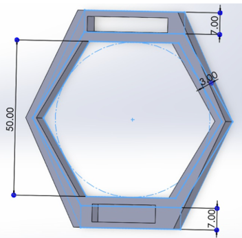
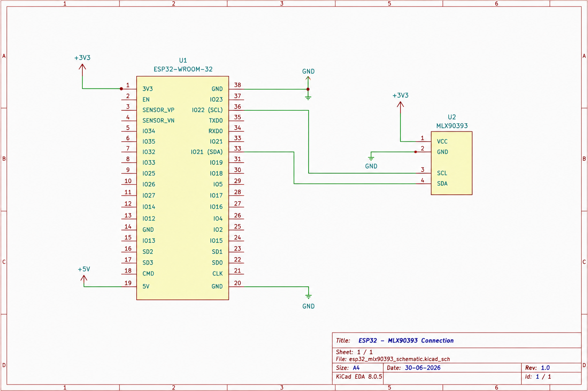
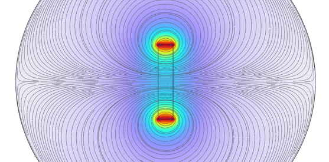
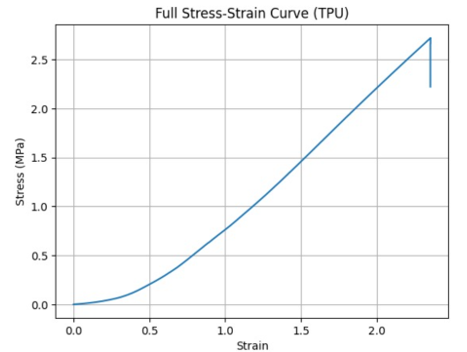

# Soft Tactile Force Sensor

<p align="center">
  
</p>

A soft tactile force sensor built using an ESP32 and an MLX90393 magnetometer. The sensor estimates contact force by tracking the movement of a small embedded magnet inside a silicone structure and sends the measurements to a local Flask server over Wi-Fi.


## About the Project

The idea for this project was to estimate contact force without using a traditional load cell.

A small magnet is embedded inside a soft silicone structure while an MLX90393 magnetometer is fixed below it. Whenever force is applied, the silicone compresses and the magnet moves closer to the sensor. This changes the measured magnetic field.

The ESP32 continuously reads the magnetic field values, estimates how much the magnet has moved, and converts that displacement into force using calibration data collected from compression tests. The calculated force is then sent over Wi-Fi to a Flask server where it can be monitored in real time.

This project combines mechanical design, embedded programming, experimental calibration, and basic web-based visualization into a single tactile sensing system.


## How It Works

The sensing principle is fairly simple. Instead of measuring force directly, the sensor measures how much the silicone deforms under an external load.

When force is applied to the top surface, the silicone compresses and the embedded magnet moves closer to the MLX90393 magnetometer. Since the magnetic field strength increases as the distance decreases, the ESP32 can estimate the displacement by monitoring the magnetic field.

The estimated displacement is then converted into force using calibration data collected from compression tests. Finally, the calculated force is sent to a local Flask server where it can be displayed in real time.

## Project Highlights

- Soft silicone based tactile sensing approach
- ESP32 firmware developed using PlatformIO
- MLX90393 3-axis magnetometer for magnetic field measurement
- Experimental force calibration using compression test data
- Real-time force estimation
- Wi-Fi communication with a Flask server
- Complete CAD models, firmware, documentation and calibration data included in this repository


<p align="center">
  
</p>

### Measurement Pipeline

```text
Applied Force
      │
      ▼
Silicone Deformation
      │
      ▼
Magnet Displacement
      │
      ▼
MLX90393 Magnetic Field Measurement
      │
      ▼
ESP32 Processing
      │
      ▼
Displacement Estimation
      │
      ▼
Force Calculation
      │
      ▼
Wi-Fi Data Transmission
      │
      ▼
Flask Server
```

### Force Estimation

The firmware first calibrates the MLX90393 to remove sensor offsets and compensate for the Earth's magnetic field. Once calibration is complete, the magnetic field magnitude is used to estimate the distance between the magnet and the sensor.

The displacement is calculated with respect to the reference position, and a lookup table obtained from experimental testing is used to estimate the corresponding force. Linear interpolation is used between calibration points to improve the resolution of the measurement.


## Repository Structure

The repository is organized so that each part of the project is kept separate. Firmware, CAD files, experimental data, documentation, and hardware files can all be accessed independently.

```text
Soft-Tactile-Force-Sensor
│
├── firmware/      ESP32 firmware (PlatformIO)
├── hardware/      Circuit diagram
├── cad/           3D models of the sensor housing
├── data/          Experimental calibration data
├── docs/          Project report
├── images/        Figures used in this README
├── media/         Project photos and videos
└── server/        Flask server for data visualization
```


## Hardware Used

The prototype was built using commonly available components.

| Component | Description |
|-----------|-------------|
| ESP32 DevKit V1 | Main controller |
| MLX90393 | 3-axis magnetometer |
| Neodymium Magnet | Embedded inside the silicone sensor |
| Silicone Structure | Deforms under external force |
| 3D Printed Housing | Holds the sensor and electronics together |


## Circuit Diagram

The ESP32 communicates with the MLX90393 over the I²C interface.

<p align="center">
  
</p>

| ESP32 | MLX90393 |
|--------|-----------|
| 3.3V | VIN |
| GND | GND |
| GPIO21 | SDA |
| GPIO22 | SCL |

The DRDY and INT pins of the MLX90393 are not used in this project.


## Software

Different parts of the project were developed using different tools.

| Software | Purpose |
|-----------|---------|
| PlatformIO | ESP32 firmware development |
| VS Code | Programming |
| SolidWorks | CAD design |
| COMSOL Multiphysics | Magnetic field simulation |
| Flask | Local server |
| Python | Data visualization |


# Results

The sensor was tested at different stages of development to verify the sensing principle and generate the calibration data used by the firmware.

Instead of estimating force directly from the magnetic field, the system first estimates the displacement of the embedded magnet and then converts that displacement into force using experimentally collected data.


## Magnetic Field vs Distance

The first experiment was performed to study how the magnetic field changes as the distance between the magnet and the MLX90393 sensor changes.

<p align="center">
  
</p>

As expected, the magnetic field increases rapidly when the magnet moves closer to the sensor. This relationship is used by the firmware to estimate the displacement of the magnet during force measurement.


## Magnetic Field Simulation

To better understand the magnetic field distribution around the magnet, a simple COMSOL simulation was performed.

<p align="center">
  
</p>

The simulation helped visualize the magnetic field around the magnet and confirmed the expected field distribution before building the prototype.


## Compression Test

Compression testing was carried out to obtain the force-displacement data required for calibration.

<p align="center">
  
</p>

The experimental data obtained from these tests was later converted into a lookup table that is used by the ESP32 firmware for force estimation.


## Force Calibration

The lookup table generated from the compression test is used to convert displacement into force.

<p align="center">
  
</p>

Instead of fitting a mathematical equation, the firmware performs linear interpolation between calibration points. This keeps the implementation simple while closely matching the experimental data.


## Prototype

The final prototype consists of the ESP32 development board, the MLX90393 sensor module, and the 3D printed housing that holds the sensing element.The ESP32 continuously measures the magnetic field, estimates the force, and sends the calculated values to the Flask server over Wi-Fi.


# Getting Started

## Clone the Repository

```bash
git clone https://github.com/pratikhadiya60/Soft-Tactile-Force-Sensor.git
cd Soft-Tactile-Force-Sensor
```

## Firmware

The firmware is developed using **PlatformIO**.

Open the `firmware` folder in VS Code with the PlatformIO extension installed.

Build the project:

```bash
PlatformIO → Build
```

Connect the ESP32 and upload the firmware:

```bash
PlatformIO → Upload
```

Before uploading, update the Wi-Fi credentials and the server IP address in `src/main.cpp`.


## Running the Flask Server

The ESP32 sends force measurements to a local Flask server over Wi-Fi.

Move to the `server` directory and install the required Python packages.

```bash
cd server
pip install -r requirements.txt
python app.py
```

Once the server is running and the ESP32 is connected to the same network, the measured force values will be transmitted automatically.


